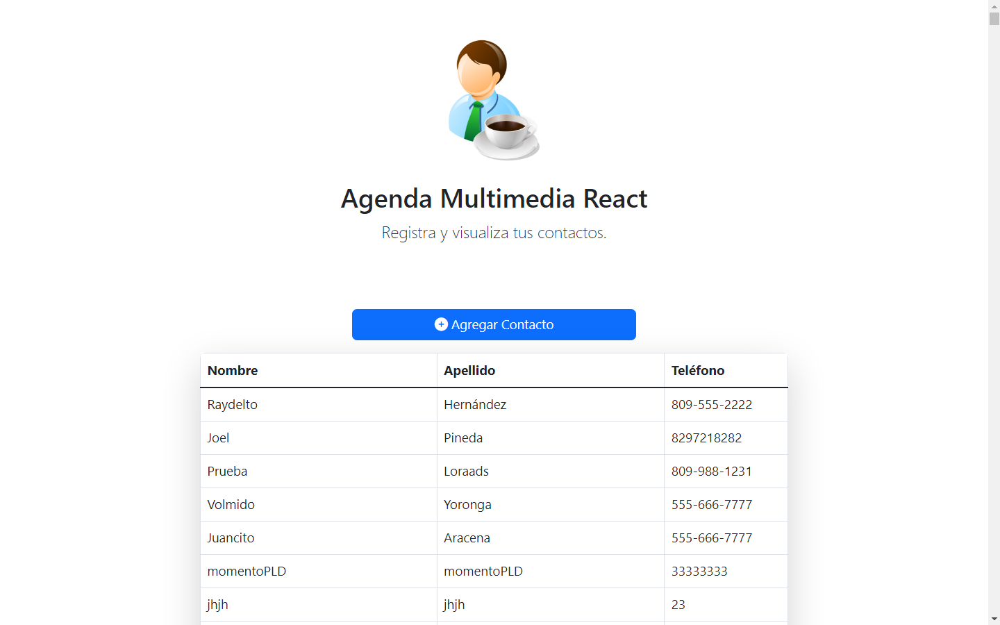
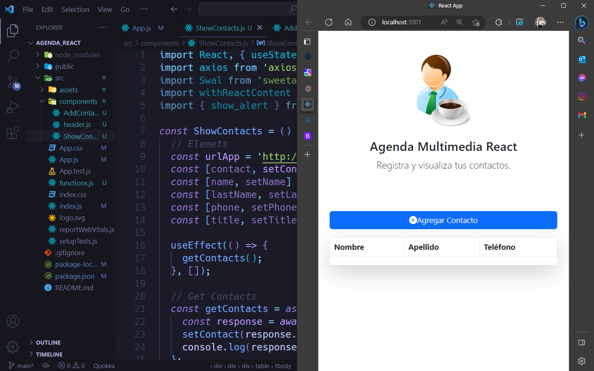

# Tarea A: Agenda React

#### 👨‍💻 Luis Emilio Valenzuela

## Descripción

Agenda multimedia desarrollado en React js, la misma mutar los datos y enviar datos a una API. Desarrollado para fines de estudio en la asignatura de Programación Web. El mismo se estará actualizando más adelante para agregar oras funcionalidades para complementar los que es un CRUD.

## Tecnologías usadas

